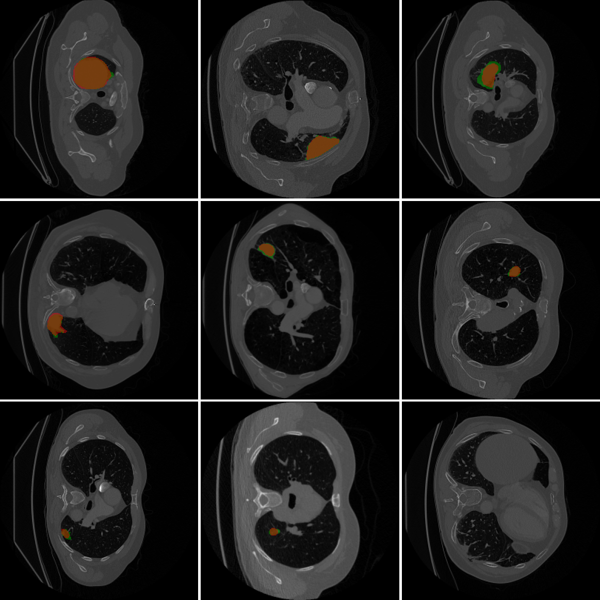
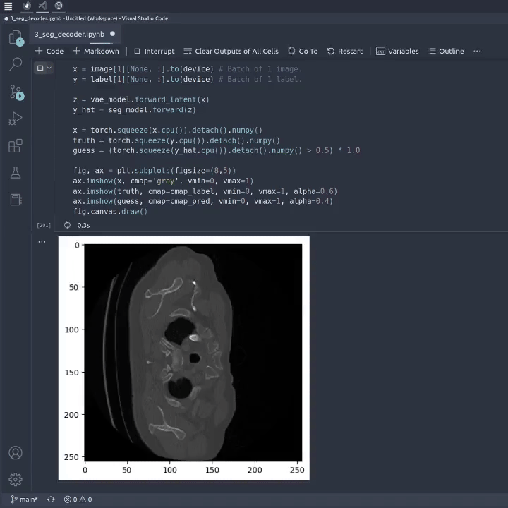

# VAE-based Tumor Segmentation
This repository contains the files and notebooks, which accompany our (Nicklas Vraa and David Felsager) final project reports. We cannot provide our data, as they take up several Gigabytes of space, but the raw datasets can be found [here](http://medicaldecathlon.com/).

This repository is identical to our [collaboratory repository](https://github.com/felsager/vae_lung_tumor_segmentation).

---
## Repository Overview
Notebooks:
- To see how we prepared and preprocessed our data, please see the notebook: \
  [1_preprocessing.ipynb](https://github.com/NicklasVraa/vae_based_segmentation/blob/main/notebooks/1_preprocessing.ipynb)

- To see how we developed our variational autoencoder, please see the notebook: \
  [2_vae_modelling.ipynb](https://github.com/NicklasVraa/vae_based_segmentation/blob/main/notebooks/2_vae_modelling.ipynb)

- To see how we developed our segmentation decoder, please see the notebook: \
  [3_seg_decoder.ipynb](https://github.com/NicklasVraa/vae_based_segmentation/blob/main/notebooks/3_seg_decoder.ipynb)

- The model architectures are defined in a separate python file for convenience: \
  [models.py](https://github.com/NicklasVraa/vae_based_segmentation/blob/main/notebooks/models.py)

- Additional utility functions and constants are also defined in a separate file: \
  [utility.py](https://github.com/NicklasVraa/vae_based_segmentation/blob/main/notebooks/utility.py)

---
## Results:
🟢 Green denotes the ground truth, set by a specialist doctor. \
🔴 Red denotes our model's prediction.

To see how the model performs on your data, please use the first notebook [1_preprocessing.ipynb](https://github.com/NicklasVraa/vae_based_segmentation/blob/main/notebooks/1_preprocessing.ipynb) to prepare your data, and then the third notebook [3_seg_decoder.ipynb](https://github.com/NicklasVraa/vae_based_segmentation/blob/main/notebooks/3_seg_decoder.ipynb) to get predictions.

---
## Real-time Testing
This GIF shows the model doing prediction in real-time. The samples are taken from a random batch each time, which is why there are many samples, that do not contain cancerous tissue.

Remember that the model is doing preditions on the testing portion of our dataset, which it has not seen before. Still, it performs quite well.

---
## Concept
This is a high-level overview of the model.

\
Thank you for your attention.

---
**LEGAL NOTICE**: This repository, including any and all of its forks and derivatives, may NOT be used in the development or training of any machine learning model of any kind, without the explicit permission of the owner of the original repository.
